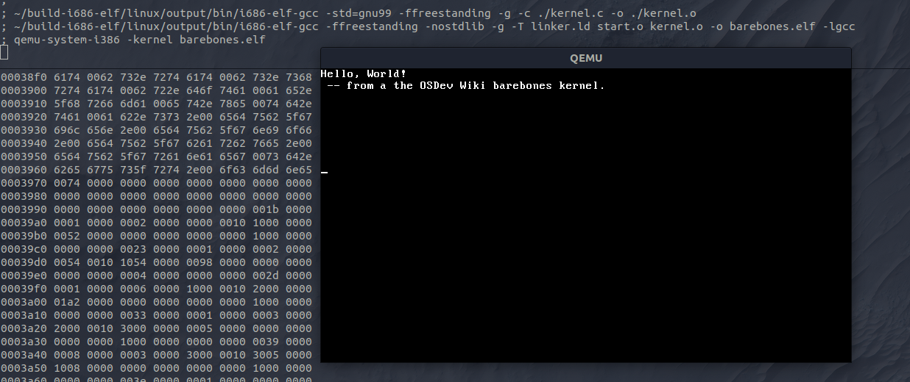

# Bares Bones OS Tutorial

From the OSDev Wiki, a very simple kernel, that just boots and prints hello world.

Link: https://wiki.osdev.org/User:Zesterer/Bare_Bones

## Needed packages and tools

Installing all necessery goodies on a debian based distro:

`sudo apt install build-essential bison flex libgmp3-dev libmpc-dev libmpfr-dev texinfo libisl-dev`


## Building GCC for cross-compilation

This repo has a tool that downloads needed sources, and builds the necessary version of gcc

https://github.com/lordmilko/i686-elf-tools


## Compile and build the image

```
~/build-i686-elf/linux/output/bin/i686-elf-gcc -std=gnu99 -ffreestanding -g -c ./start.s -o ./start.o
~/build-i686-elf/linux/output/bin/i686-elf-gcc -std=gnu99 -ffreestanding -g -c ./kernel.c -o ./kernel.o
~/build-i686-elf/linux/output/bin/i686-elf-gcc -ffreestanding -nostdlib -g -T linker.ld start.o kernel.o -o barebones.elf -lgcc
```

## Running on qemu

`qemu-system-i386 -kernel barebones.elf`




